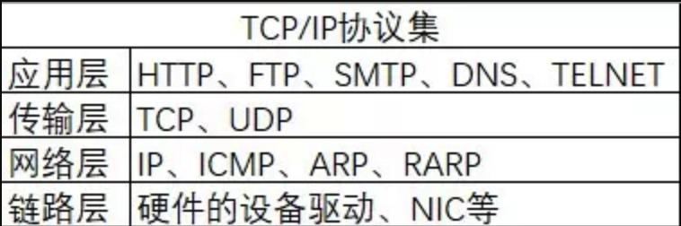

# Questions
### http 响应码 301 和 302 代表的是什么？有什么区别？
  * 301 代表永久性转移。
  * 302 代表暂时性转移。
  * 301和302状态码都表示重定向，就是浏览器在拿到服务器返回的这个状态码后会自动跳转到一个新的
  URL地址(可以从响应的location首部获取)
  * 301表示旧地址A的资源已经被永久地移除了（这个资源不可访问了），搜索引擎在获取新内容的同时也将旧的URL替换为重定向之后的URL；302表示旧地址A的资源还在（仍然可以访问），这个重定向只是临时地从旧地址A跳转到地址B，搜索引擎获取新的内容且保存旧的URL。
  * 302存在网址劫持的问题(网址劫持: 实际上搜索引擎在遇到302时, 由于搜索引擎的排名算法不能准确
  的判断哪一个URL更合适, 导致搜索引擎并不能总是抓取目标网址。也就是说某个人在自己的网址A做一个302重定向到另一个人的网址B上，处于某种原因，浏览器显示的还是网址A，但是所有的网页内容却是网址B的，这就是网址URL劫持)

### 简述 TCP 和 UDP 的区别？
* TCP 和 UDP 是传输层的两个协议。介于应用层和IP层
* UDP没有复杂的控制机制，利用ip提供面向无连接的通信服务。将应用层发来的数据直接按照原样发送
  到网络上。传送过程中发生丢包也不会进行重发。也不会控制数据包的到达顺序。
* TCP实现了传输时各种控制机制，可以丢包重发，对数据包进行顺序控制，而且是面向有连接的协议，只有
  在确认通信对象存在时，才会发送数据，控制了通信流量的浪费。其通过检验、序列号、确认应答、重发控制、连接管理以及窗口控制等机制实现可靠性传输。
* 区别如下：
  
    TCP  |  UDP
  -------|-------
  基于连接 |  无连接
  需要较多的系统资源 | 需要较少的系统资源
  数据包结构复杂 | 结构较简单
  基于数据流的协议 | 基于数据报的协议
  可靠性 | 不保证

### tcp 为什么要三次握手，两次不行吗？为什么？
* 同过三次握手的过程说明原因：
  > 1. 当客户端需要建立连接时, 向服务器发送一个syn包(syn=j), 并进入SYN_SENT状态,
    等待服务器确认。 
    **说明:** 第一次目的是客户端在确认服务器的接受数据的能力。
  > 2. 当服务器收到客户端发来的syn包时，必须确认客户端的SYN(ack=j+1), 同时自己也发送一个
    SYN(syn=k)包, 即SYN+ACK包，且服务器进入SYN_RECV状态。 
    **说明：** 第二次目的是服务器告知客户端，向其说明自己有接收数据的能力, 同时服务器也知道
    了客户端有发送数据的能力。当客户端收到服务器的SYN+ACK包时也知道了服务器有发送数据的能力。 
    **两次握手不行的原因：**  
    <1> 结果一：1. 服务器知道客户端有发送数据的能力。 2. 客户端知道服务器端有发送和接收数据的
    能力。 3. 所以导致服务器不知道客户端到底有没有接收数据的能力。此时建立的连接并不可靠。
     
    <2> 结果二：假设第一步发送的SYN包发生阻塞了，客户端迟迟没有收到服务器的应答，于是又发送了
    一个SYN包，但是这次没发生阻塞，服务器也成功应答了。因为是两次握手，所以建立连接了。当数据
    通信完成后，连接也正常断开了。假设之前阻塞的SYN包成功到达了服务器，服务器也应答了。此时连接建立。由于客户端在重发SYN包时，以为阻塞的请求已经丢失了，也不会使用该连接进行数据通信，
    所以就是导致服务器的资源浪费。(此处说明为什么三次握手可以避免这种情况：因为客户端知道发生
    阻塞的SYN包是不会被需要的，所以不会再进行第三次握手，连接也就不会建立。)
  > 3. 当客户端收到服务器的SYN+ACK包时，向服务器发送确认包ACK(ack=k+1), 此包发送完毕，客户
    端和服务器都会进入ESTABLISHED(TCP连接成功)状态，完成三次握手

### 说一下 tcp 粘包是怎么产生的？
在流传输中出现：

1. 发送端需要等缓冲区满才发送出去，造成粘包
2. 接收方不及时接收缓冲区的包，造成多个包一起接收

### TCP/IP协议集

HTTP协议是基于TCP/IP协议之上的应用层协议，TCP/IP属于传输层协议，主要解决数据在网络中的传输，而HTTP属于应用层协议，主要解决数据如何包装。在实际开发中，一般自定义协议就是指自定义应用层协议。正如寄快递一样，HTTP协议负责物品如何包装以及到达目的地之后的拆箱，TCP/IP协议就是快递公司，负责物品的运送。
